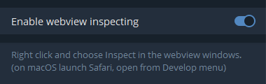

# Master Protocol Game Bot

This bot automates playing a clicker game for the Master Protocol mini-app.

## Prerequisites

- Node.js installed on your system
- npm (Node Package Manager)
- An account on the Master Protocol platform
- Git installed on your system (for cloning the repository)

## Installation

1. Clone the repository:
   - Open your terminal or command prompt.
   - Navigate to the directory where you want to install the bot.
   - Run the following command:
     ```
     git clone https://github.com/TOR968/MasterProtocolBot.git
     ```
   - This will create a new directory named `MasterProtocolBot` with the project files.

2. Navigate to the project directory:
   - Change into the newly created directory:
     ```
     cd MasterProtocolBot
     ```

3. Install the required dependencies:
   ```
   npm install
   ```

4. Rename the `.env-example` file to `.env`:
   - On Unix-based systems (Linux, macOS):
     ```
     mv .env-example .env
     ```
   - On Windows:
     ```
     ren .env-example .env
     ```

5. Open the `.env` file in a text editor and replace `YOUR_TOKEN_HERE` with your actual authentication token:
   ```
   TOKEN=your_actual_token_here
   ```

## How to Get Your Token

To obtain your authentication token:

1. Log in to the Master Protocol mini-app in telegram web or desktop.
2. Open your browser's Developer Tools (usually F12 or right-click and select "Inspect").
3. Go to the "Network" tab in the Developer Tools.
4. Refresh the page or perform any action on the site.
5. Look for requests to the API (they should start with `https://api-yield-pass.masterprotocol.xyz/`).
6. Click on one of these requests and find the "Request Headers" section.
7. Look for a header named "Authorization". The value of this header is your token.
8. Copy this token and paste it into your `.env` file.

**Important**: Keep your token secret and never share it publicly. It provides access to your account.

## Configuration

You can adjust the following constants in the script to customize the bot's behavior:

- `SCORE_MIN`: Minimum score for each game (default: 900)
- `SCORE_MAX`: Maximum score for each game (default: 1350)
- `WAIT_TIME`: Wait time between starting and ending a game in milliseconds (default: 20000)

## Usage

To run the bot, use the following command in your terminal:

```
node index.js
```

The bot will automatically:

1. Check your available energy
2. Start games based on your energy
3. Wait for 20 seconds (configurable)
4. End each game with a random score between SCORE_MIN and SCORE_MAX
5. Repeat until all energy is used

## Activating Developer Console in Telegram Desktop

To run this script using Telegram Desktop:

Open Telegram Desktop
Go to Settings > Advanced > Experimental settings
Find and enable the "Enable webview inspecting" option



On macOS: Right-click and choose "Inspect" in the webview windows, or open from the Develop menu in Safari
On Windows/Linux: Use the keyboard shortcut Ctrl + Shift + I or F12


Restart Telegram Desktop to apply the changes

## Disclaimer

This bot is for educational purposes only. Use it at your own risk and make sure you comply with the terms of service of the platform you're using it on.

## License

This project is open source and available under the [MIT License](LICENSE).
